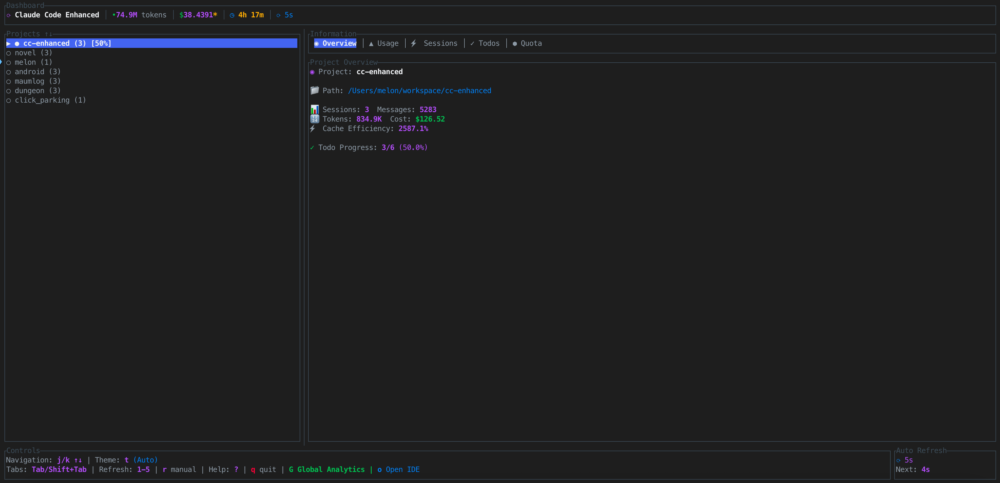
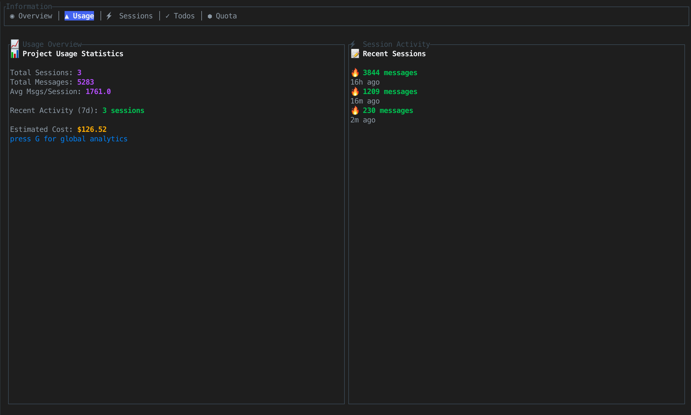
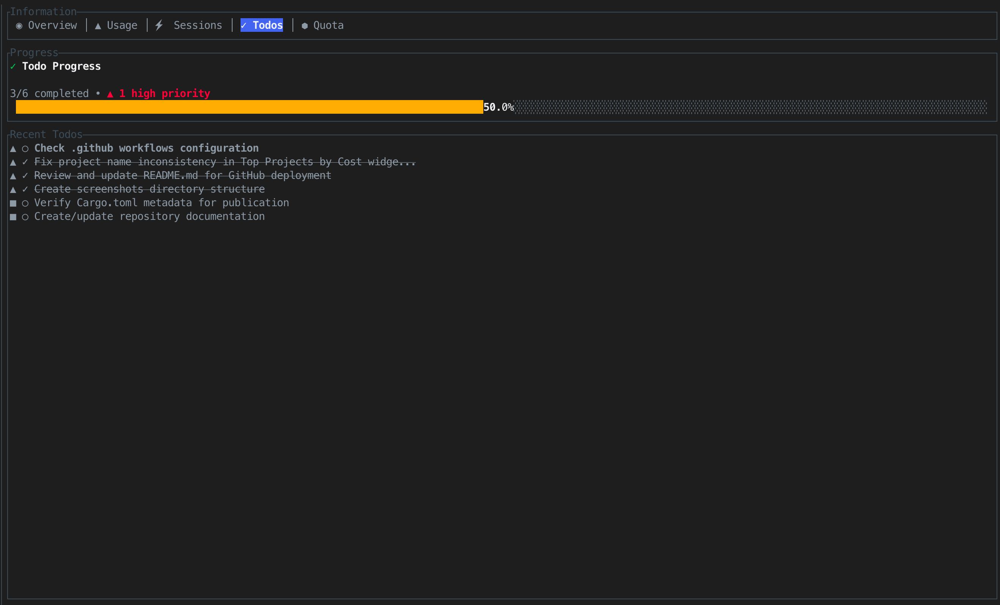
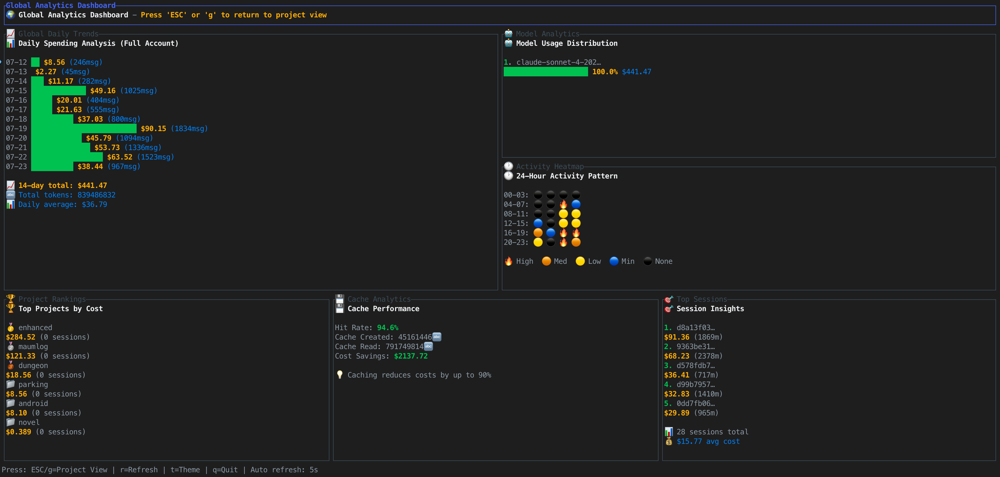
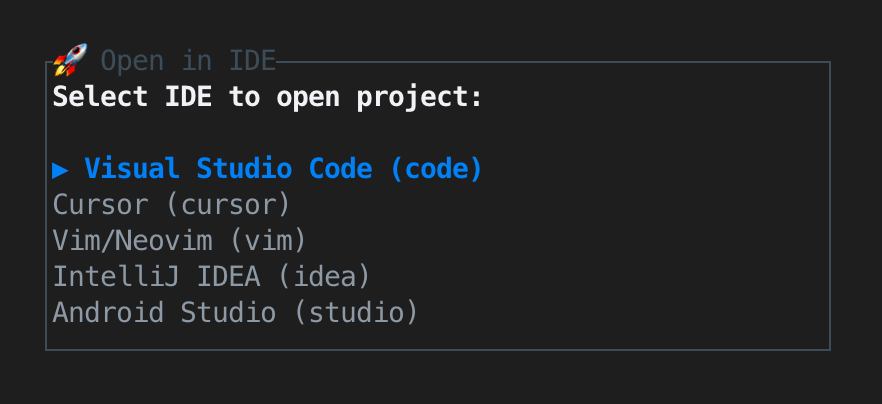

# 🚀 cc-enhanced

<div align="center">

[](https://www.rust-lang.org/)
[](#)
[](https://www.gnu.org/licenses/gpl-3.0)

**An unofficial next-generation TUI dashboard for Claude Code project management**

*Monitor usage • Track todos • Manage sessions • Analyze costs*

[Features](#-features) • [Installation](#-installation) • [Usage](#-usage) • [Screenshots](#-screenshots) • [Contributing](#-contributing)

</div>

---

## ✨ Features

### 🎯 **Smart Project Management**
- **Real-time scanning** of `~/.claude/projects/` directory
- **Intelligent path reconstruction** from sanitized project names  
- **Activity tracking** with 24-hour detection
- **Orphaned project handling** for missing directories

### 📊 **Advanced Usage Analytics**
- **Token consumption tracking** (input/output/cache tokens)
- **Daily usage statistics** with visual progress bars
- **Cost analysis** via OpenRouter API integration
- **Quota monitoring** with reset time countdown

### ✅ **Intelligent Todo System**
- **Regex-powered extraction** from Claude session files
- **Priority classification** (High/Medium/Low) with visual indicators
- **Status tracking** (Pending/In Progress/Completed)
- **Smart sorting** by priority and status

### 🎨 **Modern UI/UX**
- **7 built-in themes** (Dark, Light, Ocean, Forest, Sunset, Galaxy, Auto)
- **Unicode-safe rendering** for international text
- **Responsive layouts** with proper grapheme cluster handling
- **Real-time updates** with configurable refresh intervals (2s-60s)

### ⚡ **Performance Optimized**
- **Non-blocking async architecture** with background data loading
- **Intelligent caching** with TTL-based invalidation
- **Lazy loading** for expensive operations
- **Smooth animations** with 60fps rendering

---

## 🛠 Installation

### Prerequisites
- **Claude Code CLI** installed and configured
- Terminal with **Unicode support** recommended

### 🚀 Quick Install (Recommended)

#### Option 1: Install via Cargo
```bash
# Install from GitHub (works now)
cargo install --git https://github.com/melonicecream/cc-enhanced

# Install from crates.io (after first publish)
cargo install cc-enhanced
```

### 🔧 Development Setup
For developers who want to contribute or build from source:

```bash
# Prerequisites: Rust 1.70+ with Cargo

# Clone the repository
git clone https://github.com/melonicecream/cc-enhanced.git
cd cc-enhanced

# Build and install
cargo install --path .

# Run
cc-enhanced
```

### Development Commands
```bash
# Install development dependencies
cargo build

# Run tests
cargo test

# Run with debug logging
RUST_LOG=debug cargo run

# Format code
cargo fmt && cargo clippy
```

---

## 🚀 Usage

### Basic Navigation
```
j/k or ↑/↓     Navigate projects
Tab/Shift+Tab  Switch tabs  
1-5            Set refresh interval (2s/5s/10s/30s/60s)
t              Toggle themes
g              Global dashboard view
o              Open project in IDE
r              Manual refresh
q/Esc          Quit
```

### Advanced Features

#### 🎨 **Theme Customization**
Press `t` to cycle through themes:
- **Dark** - Professional dark theme
- **Light** - Clean light theme  
- **Ocean** - Cool blue tones
- **Forest** - Natural green palette
- **Sunset** - Warm orange hues
- **Galaxy** - Cosmic purple vibes
- **Auto** - System preference (coming soon)

#### 🔍 **Global Analytics Dashboard**
Press `g` to access:
- **Usage heatmaps** showing daily activity patterns
- **Cost breakdown** by model and token type
- **Project rankings** by usage and activity
- **Comprehensive statistics** across all sessions

#### 🎯 **Smart IDE Integration**
Press `o` to launch projects in:
- Visual Studio Code / Cursor
- IntelliJ IDEA / WebStorm / PyCharm
- Android Studio
- Vim/Neovim
- Sublime Text / Atom

---

## 📸 Screenshots & Features Gallery

### 🏠 Main Dashboard
The heart of cc-enhanced - monitor all your Claude Code projects at a glance with real-time updates and beautiful visualizations.

**Key Features:**
- **Real-time project scanning** from `~/.claude/projects/`
- **Activity indicators** (● active, ○ inactive)
- **Usage progress bars** with percentage indicators
- **Token consumption tracking** for today's usage
- **Auto-refresh** with configurable intervals



---

### 📊 Usage Analytics Tab
Deep dive into your Claude Code usage patterns with comprehensive analytics and cost tracking.

**Key Features:**
- **Daily token usage** with visual progress bars
- **Cost calculations** using real OpenRouter API pricing
- **Token type breakdown** (input/output/cache tokens)
- **Usage trends** and historical data
- **Quota monitoring** with reset countdown



---

### 📝 Sessions Management
Explore and analyze your Claude Code sessions with detailed metadata and conversation insights.

**Key Features:**
- **Session listing** with timestamps and message counts
- **Model information** (Claude-3-Sonnet, Claude-3-Haiku)
- **Token consumption** per session
- **Session duration** and activity patterns
- **Quick navigation** through conversation history


---

### ✅ Smart Todo System
Automatically extract and manage todos from your Claude Code conversations with intelligent categorization.

**Key Features:**
- **Automatic extraction** from session files using regex patterns
- **Priority classification** with visual indicators (▲ High, ■ Medium, ▼ Low)
- **Status tracking** (Pending, In Progress, Completed)
- **Smart sorting** by priority and creation date
- **Context-aware parsing** from natural language



---

### 📈 Quota Management
Keep track of your Claude Code usage limits and plan your coding sessions effectively.

**Key Features:**
- **Real-time quota tracking** with visual progress indicators
- **Reset time countdown** showing when quotas refresh
- **Usage predictions** based on current consumption patterns
- **Alert system** for approaching limits
- **Historical quota usage** patterns


---

### 🌍 Global Analytics Dashboard
Access the comprehensive analytics dashboard with `g` key for project-wide insights and trends.

**Key Features:**
- **Cross-project analytics** with usage heatmaps
- **Cost breakdown** by model and project
- **Top projects ranking** by usage and activity
- **Daily/weekly/monthly trends** visualization
- **Performance metrics** and optimization insights



---

### 🚀 IDE Integration
Press `o` to instantly launch your selected project in your preferred IDE with intelligent detection and seamless integration.

**Key Features:**
- **Smart IDE detection** - Automatically detects installed IDEs
- **One-key launch** - Press 'o' to open current project instantly
- **Multi-IDE support** - VS Code, Cursor, IntelliJ, PyCharm, WebStorm, and more
- **Project context** - Opens directly to the correct project directory
- **Background launch** - Non-blocking IDE startup



---

## 🏗️ Architecture

### 🔧 **Tech Stack**
- **[Ratatui](https://github.com/ratatui-org/ratatui)** - Modern TUI framework
- **[Tokio](https://tokio.rs/)** - Async runtime for background tasks
- **[Serde](https://serde.rs/)** - JSON serialization for Claude session files
- **[Reqwest](https://github.com/seanmonstar/reqwest)** - HTTP client for OpenRouter API
- **[Anyhow](https://github.com/dtolnay/anyhow)** - Error handling
- **[Chrono](https://github.com/chronotope/chrono)** - Date/time processing
- **[Unicode Segmentation](https://github.com/unicode-rs/unicode-segmentation)** - Proper text rendering

### 📁 **Project Structure**
```
src/
├── app.rs              # Main application state & event loop
├── claude/             # Claude data management modules
│   ├── mod.rs          # Module organization
│   ├── session_parser.rs  # JSONL file parsing
│   ├── project_scanner.rs # Project discovery
│   ├── usage_calculator.rs # Token analytics
│   └── pricing.rs      # OpenRouter API integration
├── features/
│   └── todos/          # Todo extraction & management
├── shared/
│   ├── config.rs       # XDG-compliant configuration
│   └── theme.rs        # Modern theming system
├── ui.rs               # Terminal UI rendering
└── widgets.rs          # Custom UI components
```

### 🔄 **Key Design Patterns**
- **Vertical Slice Architecture** - Feature-based module organization
- **Background Task Processing** - Non-blocking data operations
- **Caching Strategy** - TTL-based cache with intelligent invalidation
- **Error Resilience** - Graceful degradation for missing data
- **Unicode-First Design** - Proper international text support

---

## 🧪 Testing

### Test Coverage
- **45 comprehensive tests** covering all core modules
- **100% pass rate** with zero compilation warnings
- **Unit tests** for business logic validation
- **Integration tests** for component interaction

```bash
# Run all tests
cargo test

# Run with coverage (requires cargo-tarpaulin)
cargo tarpaulin --out html

# Run specific test module
cargo test claude::session_parser::tests
```

---

## 🔧 Configuration

### Config Location
- **Linux/macOS**: `~/.config/cc-enhanced/config.json`
- **Windows**: `%APPDATA%/cc-enhanced/config.json`

### Example Configuration
```json
{
  "refresh_interval_secs": 5,
  "current_tab": 0,
  "theme_mode": "Dark",
  "language": "English",
  "show_help": false
}
```

---

## 📊 Performance

### Benchmarks
- **Startup time**: <200ms for 100+ projects
- **Memory usage**: ~15MB baseline
- **CPU usage**: <1% during idle monitoring
- **Refresh latency**: <50ms for UI updates

### Optimization Features
- **Lazy loading** of project analytics
- **Background caching** with 24-hour TTL
- **Efficient JSONL streaming** for large session files
- **Smart rendering** with dirty checking

---

## 🛣️ Roadmap

### 🎯 **Version 2.0**
- [ ] **Web dashboard** companion interface
- [ ] **Export functionality** (CSV/JSON/PDF reports)
- [ ] **Custom themes** with JSON configuration
- [ ] **Plugin architecture** for extensibility
- [ ] **AI insights** and usage recommendations

### 🎯 **Version 2.1**
- [ ] **Team collaboration** features
- [ ] **Real-time notifications** for quota limits
- [ ] **Integration** with project management tools
- [ ] **Advanced filtering** and search capabilities
- [ ] **Mobile app** for monitoring on-the-go

---

## 📄 License

This project is licensed under the **GNU General Public License v3.0** - see the [LICENSE](LICENSE) file for details.

---

## 🙏 Acknowledgments

- **[Claude Code](https://claude.ai/code)** - The amazing AI coding assistant (this is an unofficial third-party tool)
- **[Ratatui Community](https://github.com/ratatui-org/ratatui)** - For the excellent TUI framework
- **[OpenRouter](https://openrouter.ai/)** - For providing model pricing APIs
- **All contributors** who help make this project better

---

<div align="center">

**⭐ Star this repo if you find it useful! ⭐**

Made with ❤️ and 🦀 Rust

[Report Bug](https://github.com/melonicecream/cc-enhanced/issues) • [Request Feature](https://github.com/melonicecream/cc-enhanced/issues)

</div>
